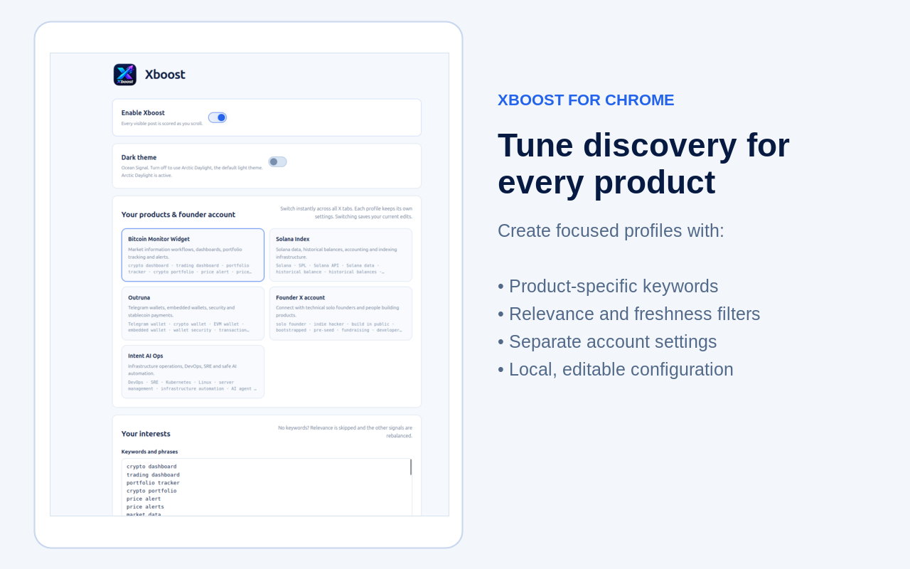
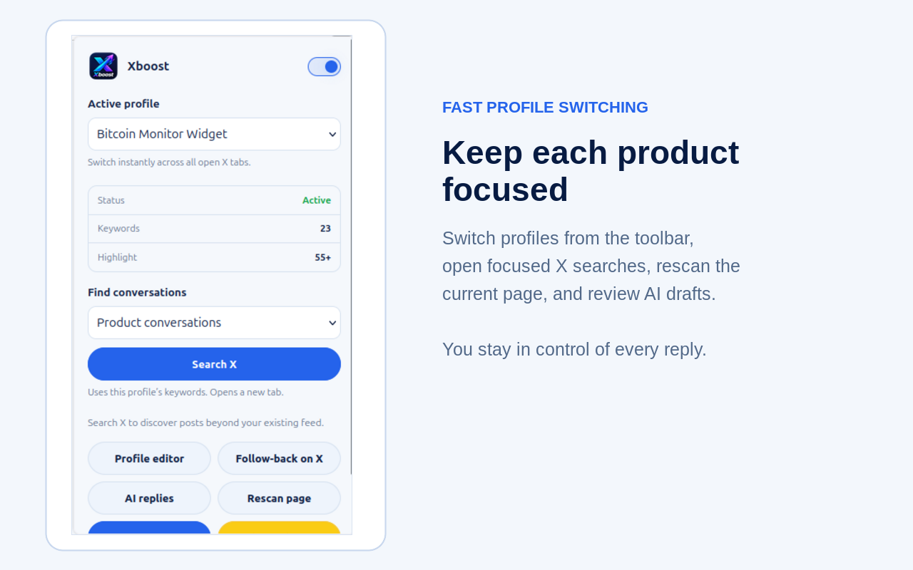
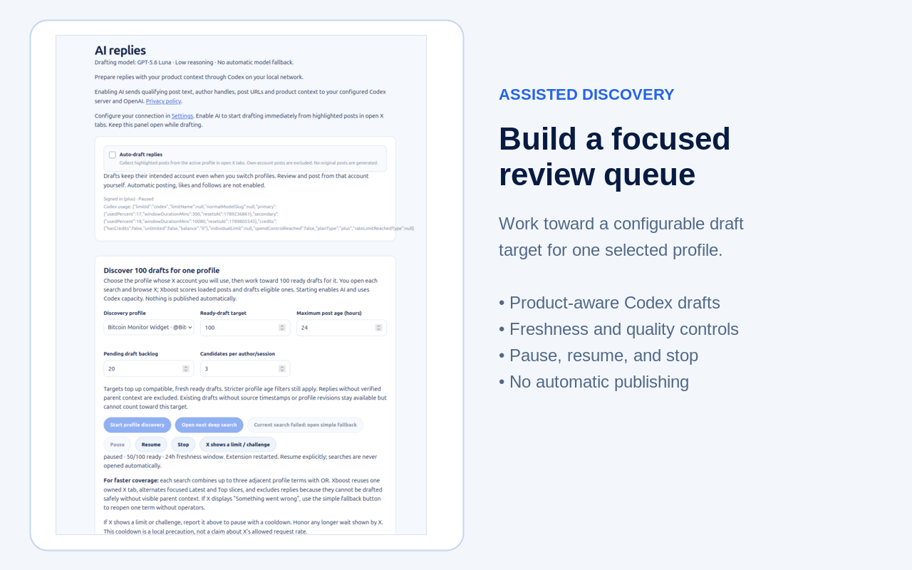
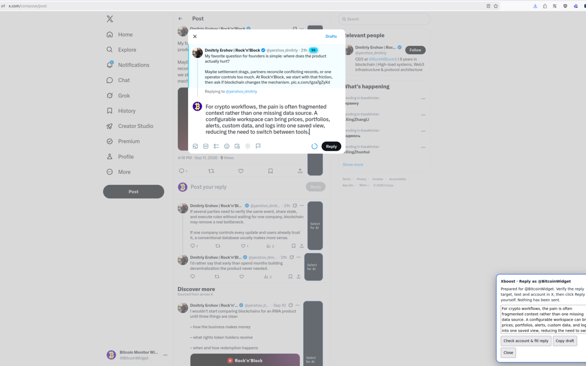

# Xboost

Xboost is a Firefox and Chrome extension for finding relevant conversations on X and drafting replies with AI. You review, edit, and publish every reply yourself.

## Features

- Create, copy, edit, delete, and quickly switch product profiles.
- Score visible X posts locally using keywords, phrases, relevance, freshness, and engagement filters.
- Open focused X searches and collect qualifying posts while you browse.
- Draft replies with profile-specific product context through your Codex App Server.
- Review drafts in a paginated queue with profile filters, saved edits, retry, dismiss, and reply history.
- Insert a reviewed draft into the X composer or copy it to the clipboard.
- Use Arctic Daylight or Ocean Signal themes.
- Keep publishing, likes, follows, and X account switching under your control.

## Screenshots

| Product profiles | Profile switching |
| --- | --- |
|  |  |

| AI discovery | Assisted reply |
| --- | --- |
|  |  |

## Usage Example

[Watch the Xboost usage example on YouTube](https://www.youtube.com/watch?v=LTtp4le0VgU).

## Install

- Firefox: install [Xboost from Mozilla Add-ons](https://addons.mozilla.org/en-US/firefox/addon/xboost/).
- Chrome: open `chrome://extensions`, enable Developer mode, choose **Load unpacked**, and select `xboost-chrome/`.

Open X after installation and configure a profile with its X handle, targeting terms, and authoritative product context. Local scoring works without AI. AI drafting requires a running Codex App Server and its WebSocket address and capability token in Xboost Settings.

## Development

The Firefox source is in `xboost/`; the Chrome source is in `xboost-chrome/`. From either folder:

```sh
npm ci
npm run check
npm run validate
npm run package
```

## Privacy

Xboost has no analytics or developer-operated collection service. With AI enabled, selected X post content and profile context pass through your configured Codex server to OpenAI. See the bundled privacy policies in `xboost/privacy.html` and `xboost-chrome/privacy.html`.

## License

MIT © 2026 Eugene Gusev. See [LICENSE](LICENSE).
